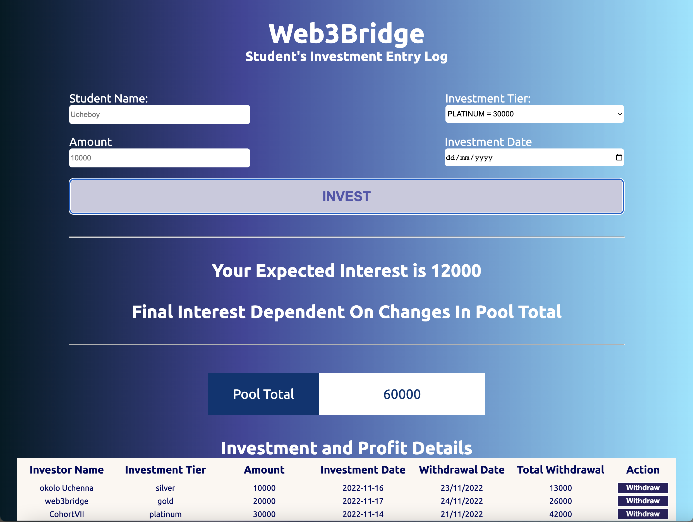

# Play To Earn
## Web3bridge Challenge

### Contents
- Introduction
- Screenshots
- Language
- Behaviour

#### Introduction.
Play To Earn is a web application that encourages [Web3bridge](https://www.web3bridge.com/) students to save and invest their savings in groups, into a play to earn blockchain game. This App takes the details of participating students as input and displays their expected return on investment after 7days in a table.

#### Screenshots

**Invalidation Appearance**
 
 

**Table Populated**

#### Languages
* Semantic HTML
* CSS
* CSS Flexbox
* JavaScript

#### Behaviour
* Error prompt for Invalid Input
* Display Individual expected interested based on pool total
* Update pool total with each investment made
* Populate students' detail in a table after submit
* Withdrawal Date and Total Withdrawal columns, display ROI maturity date and total withdrawal respectively for each student.
* Withdrawal button in table rows removes corresponding student from table
* Total Withdral for each student in table updates as more students join or exit the group.
* Group limit is 12 and does not take more than 12 entries.
